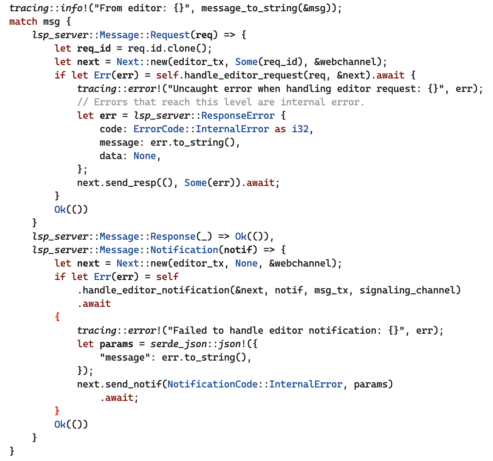
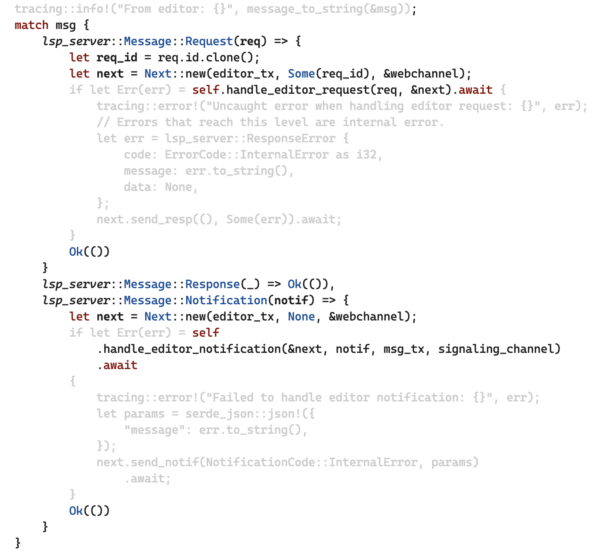

# happy-path-mode

Happy-path-mode dims error handling, logging, etc, so you can focus on
the main flow of the program.

happy-path-mode disabled:

happy-path-mode enabled:

happy-path.el supports any language that has a tree-sitter grammar.
Right now there’s only builtin support for Rust.

## Usage

Use `happy-path-mode` to enable dimming.

## Customization

The dimmed text is displayed in `happy-path-dim` face, which inherits
from `shadow` face. You can customize it to be even more subdued. The
screenshot uses #CCCCCC for foreground color.
